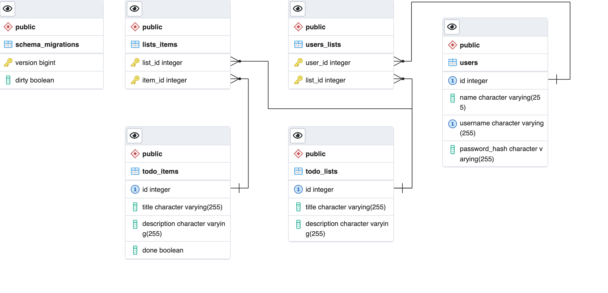

# Todo App

The project represents the configuration and setup basic server for TODO application with auto-testing and OpenAPI specification from postman's collection


[](https://goreportcard.com/report/github.com/vbetsun/todo-app)

[](https://github.com/vbetsun/todo-app)
[](https://pkg.go.dev/github.com/vbetsun/todo-app)


## Prerequisites

- Git
- Docker
- Docker Compose
  
## How to Install

Clone from github and navigate to the project's folder
```sh
# HTTPS
git clone https://github.com/vbetsun/todo-app.git

# SSH
git clone git@github.com:vbetsun/todo-app.git

cd todo-app
```

## How to Deploy

```sh
cp ./deployments/.env.example ./deployments/.env
```

change env variables for your needs

```dotenv
PORT=8000 # port for serving API
DOCS_PORT=8080 # port for serving OpenAPI documentation
POSTGRES_HOST=localhost # host of postgre db
POSTGRES_PASSWORD=someStr0ngPass # password to psql
```

and start the application via `docker compose`. It should start the API server, PostgreSQL database, pgAdmin and OpenAPI documentation, which you can see on http://localhost:${DOCS_PORT}

```sh
docker compose -f ./deployments/docker-compose.yml up -d
```

after that you have to run migrations

```sh
make migrate-up
```

## Database structure



## How to Test

for testing our API we're going to use POstman collection via Newman

```sh
make test-e2e
```
